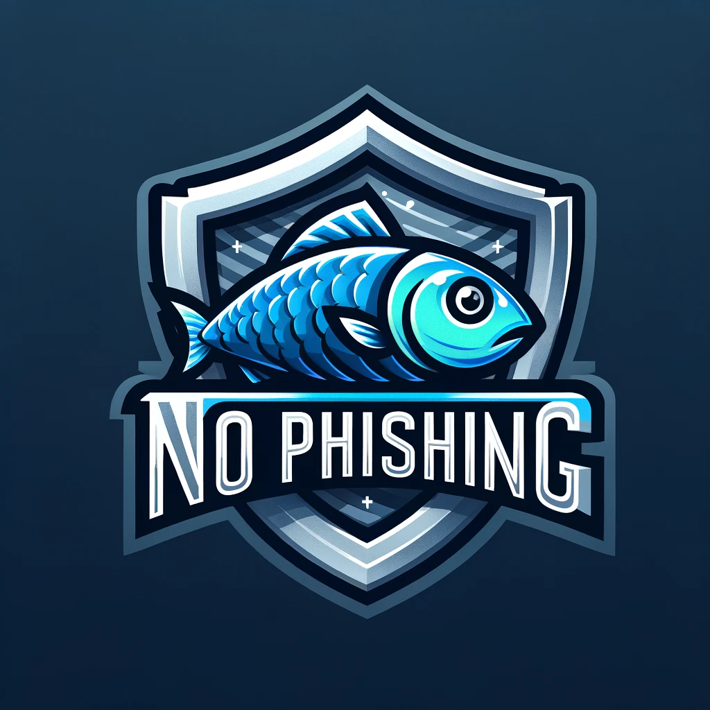

<!-- Improved compatibility of back to top link: See: https://github.com/othneildrew/Best-README-Template/pull/73 -->
<a name="readme-top"></a>

[![Contributors][contributors-shield]][contributors-url]
[![Forks][forks-shield]][forks-url]
[![Stargazers][stars-shield]][stars-url]
[![Issues][issues-shield]][issues-url]
[![GPL-2.0 license][license-shield]][license-url]
[![LinkedIn][linkedin-shield]][linkedin-url]


<!-- PROJECT LOGO -->
<br />
<div align="center">
  <a href="https://github.com/othneildrew/Best-README-Template">
    
  </a>

  <p align="center">
    <br />
    <br />
    <br />
    <a href="https://github.com/cprite/phishing-detection-ext/issues">Report Bug</a>
    ·
    <a href="https://github.com/cprite/phishing-detection-ext/issues">Request Feature</a>
  </p>
</div>


<!-- TABLE OF CONTENTS -->
<details>
  <summary>Table of Contents</summary>
  <ol>
    <li>
      <a href="#about-the-project">About The Project</a>
      <ul>
        <li><a href="#disclaimer">[!] Disclaimer</a></li>
        <li><a href="#built-with">Built With</a></li>
      </ul>
    </li>
    <li>
      <a href="#getting-started">Getting Started</a>
    </li>
    <li><a href="#roadmap">Roadmap</a></li>
    <li><a href="#contributing">Contributing</a></li>
  </ol>
</details>


<!-- ABOUT THE PROJECT -->
## About The Project

**No Phishing** is an advanced browser extension using artificial intelligence to detect phishing threats with 91% accuracy in real time and provides instant notifications about potential phishing threats. It's very easy to install and operate, providing a seamless browsing experience. It's designed for Google Chrome to enhance online security for both individuals and businesses.

### Disclaimer
This extension is intended as a supplementary tool for online safety. While it demonstrates high accuracy, it is not infallible. As the developer, I am not a certified cybersecurity professional, and the extension could make errors. Users are advised to exercise caution and judgment. By using "No Phishing," you acknowledge and accept responsibility for your online safety.

### Built With

* [](https://www.python.org)
* [](https://www.javascript.com/)
* [](https://html.spec.whatwg.org/)
* [](https://jupyterlab.readthedocs.io/en/stable)
* [](https://pandas.pydata.org/)
* [](https://numpy.org/)
* [](https://www.tensorflow.org)
* [](https://keras.io/)
* [](https://www.google.com/chrome/)
* [](https://code.visualstudio.com/)

<p align="right">(<a href="#readme-top">back to top</a>)</p>


<!-- GETTING STARTED -->
## Getting Started

1. Clone the repo
   ```sh
   git clone https://github.com/cprite/phishing-detection-ext.git
   ```
2. Install the required dependencies
   ```sh
   pip install -r requirements.txt
   ```
3. Load the extension in Google Chrome
   - Open Google Chrome and navigate to `chrome://extensions/`.
   - Enable `Developer mode` by toggling the switch in the top-right corner.
   - Click on `Load unpacked` button.
   - Navigate to the directory where you cloned the `phishing-detection-ext` repository and select it.
   - The extension should now appear in your list of installed extensions.
4. Activate the extension
   - Once installed, you'll see the extension's icon in the Chrome toolbar.
   - Click on the icon to turn ON the extension.
   - Before using the extension, start the local server by navigating to the project's root directory in the command line:
     ```sh
     cd path/to/repo/phishing-detection-ext
     python main.py
5. Ready to Go!
   - You are now all set to surf the internet safely with the "No Phishing" extension.
   - The extension will run in the background, monitoring websites you visit for potential phishing threats.
   - Stay safe and feel free to report any suspicious sites or activities you encounter.
   - Remember, your web safety is enhanced, but always stay vigilant while browsing.

<p align="right">(<a href="#readme-top">back to top</a>)</p>

<!-- ROADMAP -->
## Roadmap

- [x] **Create Demo Version**
  - Description: Developed a demo version of the extension for initial testing and feedback.
     
- [ ] **Self-Learning Capabilities**
  - Description: Implementation of a self-learning mechanism to improve the accuracy of the prediction model based on user reports.

- [ ] **Deployment on Cloud**
  - Description: Plan to deploy the backend services of the extension to a cloud platform for enhanced speed, reliability and scalability.

- [ ] **Deployment on Chrome Web Store**
  - Description: Prepare and submit the extension to the Chrome Web Store for public availability and easy installation by users.

<p align="right">(<a href="#readme-top">back to top</a>)</p>


<!-- CONTRIBUTING -->
## Contributing

Contributions are what make the open source community such an amazing place to learn, inspire, and create. Any contributions you make are **greatly appreciated**.

If you have a suggestion that would make this better, please fork the repo and create a pull request. You can also simply open an issue with the tag "enhancement".
Don't forget to give the project a star! Thanks again!

1. Fork the Project
2. Create your Feature Branch (`git checkout -b feature/AmazingFeature`)
3. Commit your Changes (`git commit -m 'Add some AmazingFeature'`)
4. Push to the Branch (`git push origin feature/AmazingFeature`)
5. Open a Pull Request

<p align="right">(<a href="#readme-top">back to top</a>)</p>

<!-- MARKDOWN LINKS & IMAGES -->
<!-- https://www.markdownguide.org/basic-syntax/#reference-style-links -->
[contributors-shield]: https://img.shields.io/github/contributors/cprite/phishing-detection-ext.svg?style=for-the-badge
[contributors-url]: https://github.com/cprite/phishing-detection-ext/graphs/contributors
[forks-shield]: https://img.shields.io/github/forks/cprite/phishing-detection-ext.svg?style=for-the-badge
[forks-url]: https://github.com/cprite/phishing-detection-ext/network/members
[stars-shield]: https://img.shields.io/github/stars/cprite/phishing-detection-ext.svg?style=for-the-badge
[stars-url]: https://github.com/cprite/phishing-detection-ext/stargazers
[issues-shield]: https://img.shields.io/github/issues/cprite/phishing-detection-ext.svg?style=for-the-badge
[issues-url]: https://github.com/cprite/phishing-detection-ext/issues
[license-shield]: https://img.shields.io/github/license/cprite/phishing-detection-ext.svg?style=for-the-badge
[license-url]: https://github.com/cprite/phishing-detection-ext/blob/master/LICENSE.md
[linkedin-shield]: https://img.shields.io/badge/-LinkedIn-black.svg?style=for-the-badge&logo=linkedin&colorB=555
[linkedin-url]: https://linkedin.com/in/niknmirosh
