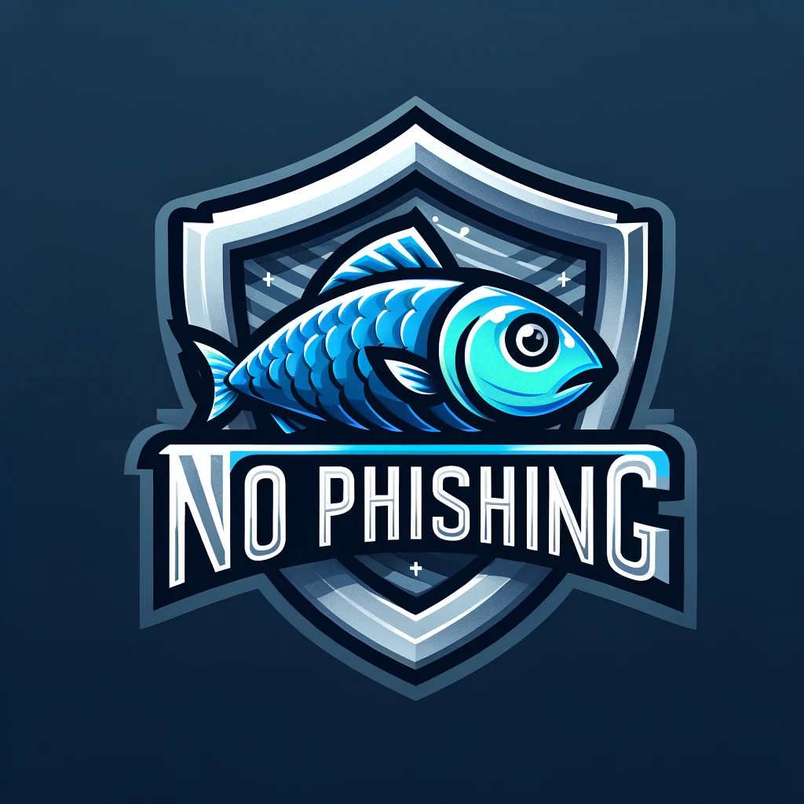

<!-- Improved compatibility of back to top link: See: https://github.com/othneildrew/Best-README-Template/pull/73 -->
<a name="readme-top"></a>

[![Contributors][contributors-shield]][contributors-url]
[![Forks][forks-shield]][forks-url]
[![Stargazers][stars-shield]][stars-url]
[![Issues][issues-shield]][issues-url]
[![GPL-2.0 license][license-shield]][license-url]
[![LinkedIn][linkedin-shield]][linkedin-url]


<!-- PROJECT LOGO -->
<br />
<div align="center">
  <a href="https://github.com/cprite/phishing-detection-ext">
    
  </a>

  <p align="center">
    <br />
    <br />
    <br />
    <a href="https://github.com/cprite/phishing-detection-ext/issues">Report Bug</a>
    ·
    <a href="https://github.com/cprite/phishing-detection-ext/issues">Request Feature</a>
  </p>
</div>


<!-- TABLE OF CONTENTS -->
<details>
  <summary>Table of Contents</summary>
  <ol>
    <li>
      <a href="#about-the-project">About The Project</a>
      <ul>
        <li><a href="#disclaimer">[!] Disclaimer</a></li>
        <li><a href="#built-with">Built With</a></li>
      </ul>
    </li>
    <li>
      <a href="#getting-started">Getting Started</a>
      <ul>
        <li><a href="#retrain-the-model">Retrain the Model</a></li>
      </ul>
    </li>
    <li><a href="#how-it-works">How It Works</a></li>
    <li><a href="#model-performance">Model Performance</a></li>
    <li><a href="#contributing">Contributing</a></li>
  </ol>
</details>


<!-- ABOUT THE PROJECT -->
## About The Project

**No Phishing** is a self-contained Chrome extension that detects phishing URLs in real time. The ML model runs **entirely inside your browser** using WebAssembly — no companion server, no data sent anywhere. It achieves **92.0% test accuracy** using a Gradient Boosting classifier trained on 11 browser-computable features.

### Disclaimer
This extension is intended as a supplementary tool for online safety. While it demonstrates high accuracy, it is not infallible. As the developer, I am not a certified cybersecurity professional, and the extension could make errors. Users are advised to exercise caution and judgment. By using "No Phishing," you acknowledge and accept responsibility for your online safety.

### Built With

* [](https://www.python.org)
* [](https://www.javascript.com/)
* [](https://html.spec.whatwg.org/)
* [](https://jupyterlab.readthedocs.io/en/stable)
* [](https://pandas.pydata.org/)
* [](https://numpy.org/)
* [](https://scikit-learn.org/)
* [](https://onnxruntime.ai/)
* [](https://www.google.com/chrome/)
* [](https://code.visualstudio.com/)

<p align="right">(<a href="#readme-top">back to top</a>)</p>


<!-- GETTING STARTED -->
## Getting Started

No Python, no server, no setup. Just load the extension:

1. Clone the repo
   ```sh
   git clone https://github.com/cprite/phishing-detection-ext.git
   ```
2. Load the extension in Google Chrome
   - Open Google Chrome and navigate to `chrome://extensions/`.
   - Enable **Developer mode** (top-right toggle).
   - Click **Load unpacked** and select the cloned `phishing-detection-ext` directory.
   - The extension appears in your Chrome toolbar.

3. Activate the extension
   - Click the extension icon and toggle it **ON**.
   - The extension will now score every page you visit locally and redirect phishing pages to a warning screen.

### Retrain the Model

The trained model (`saved_models/model.onnx`) and feature list (`saved_models/browser_features.json`) are committed and ready to use. To retrain from scratch:

1. Download the dataset from Kaggle:  
   [Web page phishing detection dataset](https://www.kaggle.com/datasets/shashwatwork/web-page-phishing-detection-dataset/data)  
   Save it as `raw_data/dataset_phishing.csv`.

2. Install training dependencies and run:
   ```sh
   pip install -r requirements.txt
   python train_browser.py
   ```
   This overwrites `saved_models/model.onnx` and `saved_models/browser_features.json`.

The original 22-feature KNN baseline and browser feature selection rationale are documented in `cyberguard_phishing_detection.ipynb`.

<p align="right">(<a href="#readme-top">back to top</a>)</p>


<!-- HOW IT WORKS -->
## How It Works

Everything runs locally in your browser. No server, no network calls, no data leaves your device.

**Content script** (`extension/content.js`) — injected into every http/https page at `document_idle`. Sends the current URL and hyperlink count (`document.querySelectorAll('a').length`) to the service worker.

**Service worker** (`extension/background.js`) — receives the page report, extracts 11 features from the URL string and hyperlink count via `extension/features.js`, and sends them to the offscreen document for inference.

**Offscreen document** (`extension/offscreen.html` / `offscreen.js`) — hosts [onnxruntime-web](https://onnxruntime.ai/docs/get-started/with-javascript/web.html) (WebAssembly, bundled in `extension/vendor/`). Loads `saved_models/model.onnx` once, then scores each feature vector. Returns `PHISHING` or `OK`. If phishing, the service worker redirects the tab to the built-in warning page.

**Trusted sites** — clicking **Proceed** on a warning adds that page's hostname to a local trusted list (`chrome.storage.local`). Pages on a trusted hostname skip the model on future visits. Manage (and remove) trusted sites from the extension popup. The list never leaves your device.

**The 11 features** — 10 lexical features derived from the URL string (length, character counts, digit ratio, suspicious-token hits) plus the page hyperlink count. WHOIS lookups, redirect-history probes, and word-length features that require a public-suffix-aware tokenizer are all omitted — they either cannot be computed client-side or cannot be reproduced in JS with exact parity to the training data. The remaining accuracy trade-off vs the old 22-feature server model is under 1 point.

**Model** — `saved_models/model.onnx` is a MinMaxScaler + Gradient Boosting classifier (n_estimators=300, max_depth=4) exported via [skl2onnx](https://onnx.ai/sklearn-onnx/), 332 KB. Trained on the [Hannousse & Yahiouche phishing dataset](https://www.kaggle.com/datasets/shashwatwork/web-page-phishing-detection-dataset/data) (≈9 600 samples after cleaning). Feature formulas are verified to produce 800/800 exact-match parity with the training dataset columns.

<p align="right">(<a href="#readme-top">back to top</a>)</p>


<!-- SELF-LEARNING -->
## Self-Learning (open-source build)

The open-source build closes the loop: it collects your corrections and lets you fold them back into the model. (This is **disabled in the Chrome Web Store build** — see [Builds](#builds).)

Because an ONNX model can't be retrained inside the browser, it's a two-step cycle:

**Step 1 — collect feedback (in the browser).** Corrections are saved locally to `chrome.storage.local` as `{url, label, ts}`. Two triggers:
- Clicking **Proceed** on a warning records the page as `legitimate` (a false positive the model got wrong).
- The popup's **Mark this site as phishing** button records the current tab as `phishing` (a phishing page the model missed).

**Step 2 — retrain (locally).** In the popup, click **Export feedback** to download `phishing-feedback.json`, then run:

```sh
python retrain_from_feedback.py phishing-feedback.json
```

This computes each feedback URL's features, appends the examples to the dataset (up-weighted so a few corrections actually shift the model — tune with `--weight`), retrains, and overwrites `saved_models/model.onnx`. Reload the unpacked extension (`chrome://extensions` → ⟳) to pick up the new model.

<a name="builds"></a>
### Builds

The **repository is the open-source build** (`extension/config.js` → `IS_OSS_BUILD = true`): all of the self-learning features above are included.

The **Chrome Web Store build** strips them. Generate it with:

```sh
python build_cws.py
```

This writes `dist/cws/` (load it to verify) and `dist/no-phishing-cws.zip` (upload it). It flips `IS_OSS_BUILD = false` — hiding the feedback buttons and disabling all feedback collection — and leaves the Python scripts, dataset and docs out of the package.

<p align="right">(<a href="#readme-top">back to top</a>)</p>


<!-- MODEL PERFORMANCE -->
## Model Performance

Results on the held-out test set (20% split, stratified, `random_state=42`):

| Model | Features | Test Accuracy | Phishing Precision | Phishing Recall |
|-------|----------|:---:|:---:|:---:|
| KNN (k=3, manhattan) — previous server build | 22 (incl. WHOIS) | 92.65% | 93.98% | 90.89% |
| **Gradient Boosting + ONNX — this build** | **11 (browser-only)** | **92.03%** | **91.50%** | **92.37%** |

Under 1 point separates the two builds. The in-browser model requires no companion server and 100% ONNX inference parity is verified against sklearn on the test set.

<p align="right">(<a href="#readme-top">back to top</a>)</p>


<!-- CONTRIBUTING -->
## Contributing

Contributions are what make the open source community such an amazing place to learn, inspire, and create. Any contributions you make are **greatly appreciated**.

If you have a suggestion that would make this better, please fork the repo and create a pull request. You can also simply open an issue with the tag "enhancement".
Don't forget to give the project a star! Thanks again!

1. Fork the Project
2. Create your Feature Branch (`git checkout -b feature/AmazingFeature`)
3. Commit your Changes (`git commit -m 'Add some AmazingFeature'`)
4. Push to the Branch (`git push origin feature/AmazingFeature`)
5. Open a Pull Request

<p align="right">(<a href="#readme-top">back to top</a>)</p>

<!-- MARKDOWN LINKS & IMAGES -->
<!-- https://www.markdownguide.org/basic-syntax/#reference-style-links -->
[contributors-shield]: https://img.shields.io/github/contributors/cprite/phishing-detection-ext.svg?style=for-the-badge
[contributors-url]: https://github.com/cprite/phishing-detection-ext/graphs/contributors
[forks-shield]: https://img.shields.io/github/forks/cprite/phishing-detection-ext.svg?style=for-the-badge
[forks-url]: https://github.com/cprite/phishing-detection-ext/network/members
[stars-shield]: https://img.shields.io/github/stars/cprite/phishing-detection-ext.svg?style=for-the-badge
[stars-url]: https://github.com/cprite/phishing-detection-ext/stargazers
[issues-shield]: https://img.shields.io/github/issues/cprite/phishing-detection-ext.svg?style=for-the-badge
[issues-url]: https://github.com/cprite/phishing-detection-ext/issues
[license-shield]: https://img.shields.io/github/license/cprite/phishing-detection-ext.svg?style=for-the-badge
[license-url]: https://github.com/cprite/phishing-detection-ext/blob/master/LICENSE.md
[linkedin-shield]: https://img.shields.io/badge/-LinkedIn-black.svg?style=for-the-badge&logo=linkedin&colorB=555
[linkedin-url]: https://linkedin.com/in/niknmirosh
